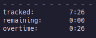

# minitrack.nvim

A fast and minimalist time tracking plugin for Neovim.

Don't waste time tracking your time. 

I hate time tracking tools so much I made one. It is meant to be used as a quick scratchpad to store each time you switch from one topic to another (project, ticket, ...) during the day. The report part provides the total time spent on each topic. So at the end of the day, you can seize them on any corporate tracking software you use.  


## Installation
### Package managers

Using [packer.nvim](https://github.com/wbthomason/packer.nvim)

```lua
use {
    'davlord/minitrack.nvim',
}
```

Using [lazy.nvim](https://github.com/folke/lazy.nvim)

```lua
{
    'davlord/minitrack.nvim
}
```
### Setup
```lua
require('minitrack').setup()
```

## Usage

### Startup
From within Neovim startup with `:Minitrack` command.

Or just start Neovim directly with Minitrack `nvim -c ":Minitrack"`.

### Tracking time
The left pane is used for time tracking and the right pane is the report pane.

### Default keybindings

#### Tracking pane keybindings
- `Ctrl+i` insert current time (if today)
  
#### Report pane keybindings
- `Ctrl+i` switch to tracing pane and insert current time at last line (if today)
- `Ctrl+left` go to previous day
- `Ctrl+right` go to next day
- `Ctrl+down` go to today
- `s` toggle sort (by name / by duration)
- `m` switch between report modes (by default there is only a single report mode)
- `y` copy report details lines (duration by topic)

## Configuration
You can pass options to setup :
```lua
require("minitrack").setup{
	catchphrase = "make time tracking great again",
	keybinds = {
		insert_current_time = "<C-i>",
		navigate_day_previous = "<C-Left>",
		navigate_day_next = "<C-Right>",
		navigate_day_today = "<C-Down>",
		change_report_mode = "m",
		change_report_sort = "s",
		copy_report_details = "y",
	},
    	report_default_mode = "standard",
}
```
- `catchphrase` Set the catchprase which appears below the title
- `keybinds` Change keybindings
  - `insert_current_time` Insert current time keybind
  - `navigate_day_previous` Go to previous day  keybind
  - `navigate_day_next` Go to next day keybindn 
  - `navigate_day_today` Go to today keybind
  - `change_report_mode` Switch report mode keybind
  - `change_report_sort` Switch report details sort by name/duration keybind
  - `copy_report_details` Copy report details lines into clipboard keybind
- `report_modes` See [report modes](#report-modes) for usage
- `report_default_mode` The report mode displayed by default

## Report customization
The report is split in mutliple sections. Each section is managed by a specific renderer which is bound to a specific name.


1. `title` section renderer
2. `day` section renderer
3. `details` section renderer
4. `summary` section renderer

Blue lines represent a special renderer `separator` which is used multiple times.

The report content can be configured with the following setup options :

```lua
require("minitrack").setup{
    report_modes = {
	["standard"] = {
	    "title",
	    "separator",
	    "day",
	    "separator",
	    "details",
	    "separator",
	    "summary",
	}
    },
}
```

So for instance if you want to get rid of the title section you just have to remove the unwanted renderers :

```lua
require("minitrack").setup{
    report_modes = {
	["standard"] = {
	    "day",
	    "separator",
	    "details",
	    "separator",
	    "summary",
	}
    },
}
```

### Report modes
In the default configuration the only report mode which exists is named "standard". 
You can add any modes as you which adding more keys in `report_modes` configuration tables.

For example if you want to add a "zen mode" without title and separators :
```lua
require("minitrack").setup{
    report_modes = {
	["zen"] = {
	    "day",
	    "details",
	    "summary",
	},
    },
}
```
Then you can switch between modes using `m` (default keybind)


### Adding/modifying renderers
To be able to add or modify report renderers see [extensions](#extensions)

## Extensions
To enable an extension just call setup method on it before minitrack setup :
```lua
require("minitrack.extensions").setup("some_extension")
require("minitrack").setup{
    -- ...
}
```

### Builtin extensions
Minitrack comes with two builtin extensions :
- `remaining_time` which completes the report summary with information relative to a fixed target amount of tracking per day.
- `unalias` which add an unalias report mode which displays report details using a mapping between something you typed in the tracking and a real world complete label (e.g. a real ticket number)
#### remaining_time extension
Enable extension and configure it through `expected_duration` configuration key as the following :
```lua
require("minitrack.extensions").setup("remaining_time")
require("minitrack").setup{
    expected_duration = 7 * 60, -- expects 7 hours of tracking per day
    -- ...
}
```


